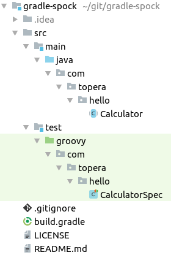

# Topera's Hello World #004
## Spock configured with Gradle
This hello world shows a unit test executed in Spock.

* Test classes are groovy files in src/test/groovy folder.
* Production code are java files in src/main/java folder.

## How to download this source code
* Install [Gradle](https://gradle.org/install)
* Use the `Clone or download` button above the get the url of this repository
* In IntelliJ IDEA: File → New → Project From Version Control → Git → put the url of this repository

## How to test
* `$ cd gradle-spock`
* `$ gradle test`
* The test will fail on purpose. Open the HTML report generated in ./build/reports/tests/test/index.html

## Tech Stack
* Intellij IDEA 2016.1.4
* Gradle 4.0.0
* Java 8
* Spock 1.1

## Folder Structure

To take a look in other projects, please see https://github.com/topera/index

